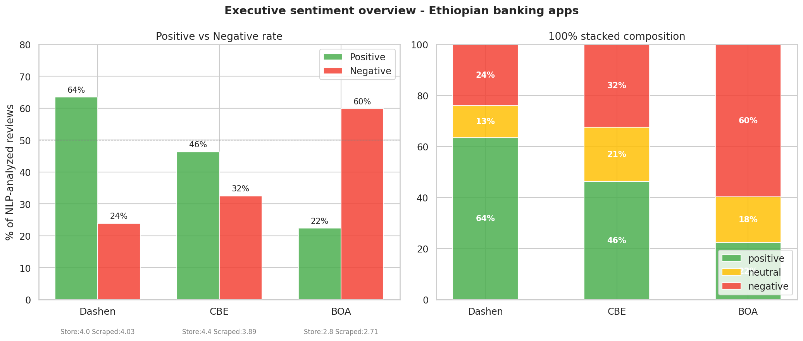
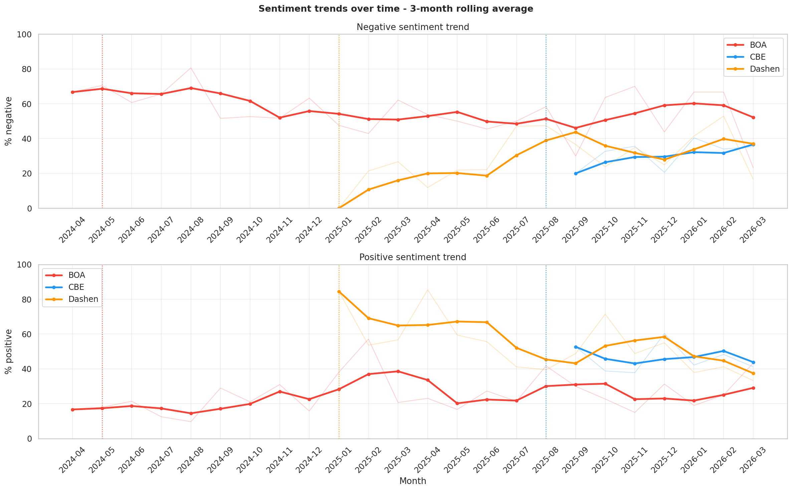
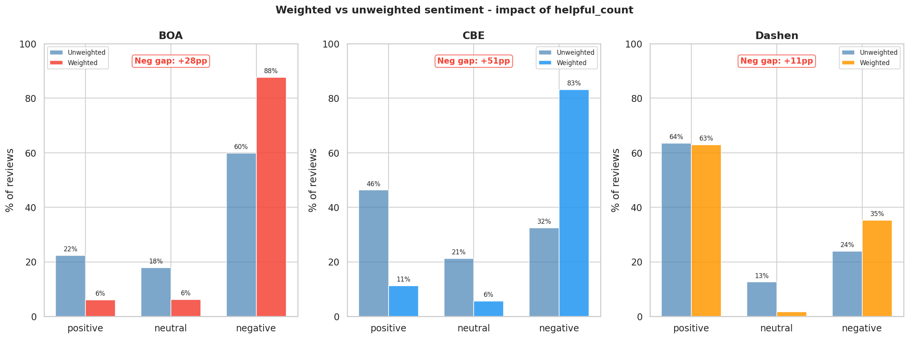
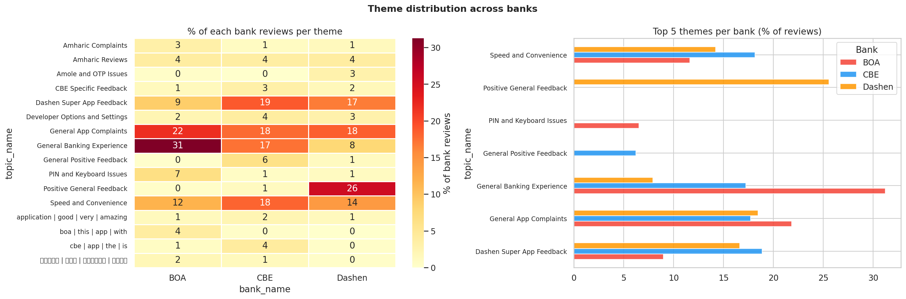
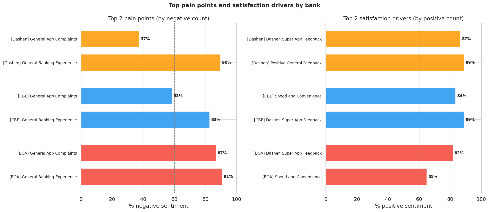
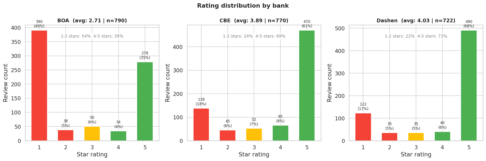
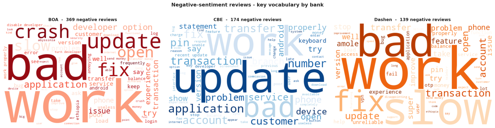

# Customer Experience Analytics for Ethiopian Fintech Apps

> Scraping, analyzing, and visualizing Google Play Store reviews for three Ethiopian banks to derive actionable product insights.

[](https://www.python.org/)[](https://www.kaggle.com/)[](https://duckdb.org/)[](LICENSE)

---

## Table of Contents

- [Overview](#overview)
- [Business Objective](#business-objective)
- [Dataset](#dataset)
- [Project Structure](#project-structure)
- [Pipeline Architecture](#pipeline-architecture)
- [Tasks](#tasks)
  - [Task 1 — Data Collection](#task-1--data-collection)
  - [Task 2 — NLP Pipeline](#task-2--nlp-pipeline)
  - [Task 3 — Database Storage](#task-3--database-storage)
  - [Task 4 — Insights and Visualizations](#task-4--insights-and-visualizations)
- [Key Findings](#key-findings)
- [Visualizations](#visualizations)
- [Tech Stack](#tech-stack)
- [Setup and Installation](#setup-and-installation)
- [Running the Project](#running-the-project)
- [Results Summary](#results-summary)
- [Ethics and Bias Disclosure](#ethics-and-bias-disclosure)
- [Key Learnings](#key-learnings)
- [Contributors](#contributors)

---

## Overview

This project analyzes customer satisfaction with mobile banking apps by collecting and processing user reviews from the Google Play Store for three Ethiopian banks:

| Bank                              | App                              | Store Rating | Reviews Collected |
| --------------------------------- | -------------------------------- | ------------ | ----------------- |
| Commercial Bank of Ethiopia (CBE) | `com.combanketh.mobilebanking` | 4.4 ★       | 769               |
| Bank of Abyssinia (BOA)           | `com.boa.boaMobileBanking`     | 2.8 ★       | 791               |
| Dashen Bank                       | `com.dashen.dashensuperapp`    | 4.0 ★       | 722               |

**Total dataset:** 2,282 verified reviews spanning April 2024 to March 2026.

The analysis simulates the role of a Data Analyst at **Omega Consultancy**, a firm advising Ethiopian banks on how to improve their mobile apps to enhance customer retention and satisfaction.

---

## Business Objective

- Scrape user reviews from Google Play Store
- Analyze sentiment (positive / neutral / negative) using transformer-based NLP
- Extract recurring themes and pain points using topic modeling
- Identify satisfaction drivers and friction points per bank
- Store cleaned data in a relational database with analytical SQL queries
- Deliver a report with visualizations and evidence-backed recommendations

---

## Dataset

Reviews were scraped using the `google-play-scraper` Python library. The final clean dataset has the following schema:

| Column                | Type  | Description                           |
| --------------------- | ----- | ------------------------------------- |
| `review_id`         | str   | Google Play unique identifier         |
| `review`            | str   | Normalized review text                |
| `rating`            | int   | 1–5 star rating                      |
| `date`              | date  | YYYY-MM-DD format                     |
| `bank`              | str   | CBE / BOA / Dashen                    |
| `helpful_count`     | int   | Thumbs-up votes from other users      |
| `language`          | str   | ISO 639-1 detected language code      |
| `is_short_review`   | bool  | True if review is under 10 characters |
| `developer_replied` | bool  | True if bank responded to review      |
| `sentiment_label`   | str   | positive / neutral / negative         |
| `sentiment_score`   | float | Model confidence 0.0–1.0             |
| `topic_id`          | int   | BERTopic cluster ID (-1 = outlier)    |
| `topic_name`        | str   | Business-readable theme name          |

---

## Project Structure

```
Customer-Experience-Analytics/
│
├── notebooks/
│   ├── task_1_data_collection.ipynb       # Scraping + preprocessing
│   ├── task_2_nlp_pipeline.ipynb          # Sentiment + topic modeling
│   ├── task_3_database.ipynb              # DuckDB schema + SQL queries
│   └── task_4_visualization_report.ipynb  # Charts + recommendations
│
├── outputs/
│   ├── reviews_raw.csv                    # Unmodified scraped data
│   ├── reviews_clean.csv                  # Preprocessed dataset
│   ├── reviews_enriched.csv               # Full NLP-labeled dataset
│   ├── keywords_per_bank.csv              # TF-IDF keywords per bank
│   ├── topics_summary.csv                 # BERTopic topic metadata
│   ├── bank_reviews.duckdb                # Full relational database (git-ignored)
│   ├── bank_reviews_dump.sql              # SQL schema + sample data
│   ├── data_quality_report.csv            # Data validation metrics
│   ├── exploratory_charts/                # Intermediate EDA charts
│   └── query_results/
│       ├── q1_sentiment_summary.csv
│       ├── q2_monthly_sentiment_trend.csv
│       ├── q3_theme_analysis.csv
│       ├── q4_weighted_sentiment.csv
│       ├── q5_bank_scorecard.csv
│       └── q6_investigation_windows.csv
│
├── charts/
│   ├── chart1_executive_overview.png
│   ├── chart2_sentiment_trends.png
│   ├── chart3_weighted_sentiment.png
│   ├── chart4_theme_distribution.png
│   ├── chart5_pain_points_drivers.png
│   ├── chart6_rating_distribution.png
│   └── chart7_wordclouds_negative.png
│
├── report/
│   ├── B5W2_Customer_Experience_Analytics_Report.docx
│   └── B5W2_Customer_Experience_Analytics_Report.pdf
│
├── requirements.txt
├── .gitignore
└── README.md
```

---

## Pipeline Architecture

```
Google Play Store
       │
       ▼
┌─────────────────────────────────────────────┐
│  Task 1 — Data Collection                   │
│  google-play-scraper + ThreadPoolExecutor   │
│  → 2,282 clean reviews (reviews_clean.csv)  │
└─────────────────────┬───────────────────────┘
                      │
                      ▼
┌─────────────────────────────────────────────┐
│  Task 2 — NLP Pipeline                      │
│  ├── RoBERTa (twitter-roberta-base)         │
│  │   → sentiment_label + sentiment_score    │
│  ├── BERTopic (all-MiniLM-L6-v2)           │
│  │   → topic_id + topic_name               │
│  └── TF-IDF (scikit-learn)                 │
│      → keywords_per_bank.csv               │
│  → reviews_enriched.csv                    │
└─────────────────────┬───────────────────────┘
                      │
                      ▼
┌─────────────────────────────────────────────┐
│  Task 3 — Database Storage                  │
│  DuckDB — 3-table normalized schema         │
│  ├── banks (3 rows)                         │
│  ├── topics (15 rows)                       │
│  └── reviews (2,282 rows)                   │
│  6 analytical SQL queries with window fns   │
│  → bank_reviews.duckdb                      │
│  → bank_reviews_dump.sql                    │
└─────────────────────┬───────────────────────┘
                      │
                      ▼
┌─────────────────────────────────────────────┐
│  Task 4 — Insights + Visualizations         │
│  Matplotlib + Seaborn + WordCloud            │
│  → 7 charts + recommendations + report      │
└─────────────────────────────────────────────┘
```

---

## Tasks

### Task 1 — Data Collection

**Objective:** Scrape and preprocess Google Play reviews for all three banks.

**Key implementation decisions:**

- `ThreadPoolExecutor` with `max_workers=3` runs all three scrapers simultaneously, reducing scraping time from ~9 minutes to ~3 minutes
- Exponential backoff retry logic (`RETRY_DELAY * (2 ** attempt)`) handles rate limiting without crashing
- Defensive column selection handles apps that return lighter response schemas than expected
- `langdetect` identifies the language of each review; non-English reviews are flagged rather than silently dropped
- Target of 1,000 reviews per bank compensates for the expected ~21% deduplication loss

**Output metrics:**

| Metric                | Result               |
| --------------------- | -------------------- |
| Raw reviews collected | 2,905                |
| After deduplication   | 2,282                |
| Missing text rate     | 0.00%                |
| English reviews       | 70.4%                |
| Date range            | Apr 2024 – Mar 2026 |

---

### Task 2 — NLP Pipeline

**Objective:** Label every review with sentiment and assign it to a thematic cluster.

#### Sentiment Analysis

Model: `cardiffnlp/twitter-roberta-base-sentiment-latest`

Selected over `distilbert-base-uncased-finetuned-sst-2-english` because:

- SST-2 was trained on movie reviews — formal, long-form English
- RoBERTa Twitter was fine-tuned on 124 million tweets — short, informal, user-generated text structurally closer to app reviews
- Outputs 3 classes natively (positive / neutral / negative) vs SST-2's 2 classes

**Validation against star ratings (alignment scores):**

| Bank   | Alignment Score |
| ------ | --------------- |
| Dashen | 84.0%           |
| BOA    | 72.0%           |
| CBE    | 71.8%           |

All banks exceeded the 70% acceptance threshold.

#### Thematic Analysis

Model: `BERTopic` with `all-MiniLM-L6-v2` sentence embeddings

Pipeline:

1. Embed each review into a 384-dimensional vector
2. Reduce to 10 dimensions using UMAP (preserves local structure)
3. Cluster with HDBSCAN (density-based, no need to specify k in advance)
4. Label each cluster using class-based TF-IDF (c-TF-IDF)
5. Manually assign business-readable names to discovered topics

**Results:** 14 topics discovered, 19.9% outlier rate (below 20% target)

#### Keyword Extraction

`TfidfVectorizer` with `ngram_range=(1,2)` on per-bank corpora identifies the most statistically distinctive vocabulary per bank:

| Bank   | Top Keywords                                                        |
| ------ | ------------------------------------------------------------------- |
| BOA    | work, bad, update, developer, crash, fix, developer option          |
| CBE    | update, work, application, service, transaction, transfer, account  |
| Dashen | super, fast, easy, work, feature, friendly, transaction, experience |

---

### Task 3 — Database Storage

**Objective:** Store the enriched dataset in a normalized relational schema and run analytical SQL queries.

**Why DuckDB over Oracle XE:**

| Criterion              | Oracle XE                   | DuckDB                  |
| ---------------------- | --------------------------- | ----------------------- |
| Kaggle setup           | System install, often fails | `pip install duckdb`  |
| Analytical performance | OLTP-optimized              | Columnar OLAP engine    |
| Portability            | Requires Oracle everywhere  | Single `.duckdb` file |
| Window functions       | Supported                   | Supported + faster      |

**Schema:**

```sql
CREATE TABLE banks (
    bank_id      INTEGER PRIMARY KEY,
    bank_name    VARCHAR NOT NULL,
    app_id       VARCHAR NOT NULL,
    known_rating DOUBLE
);

CREATE TABLE topics (
    topic_id   INTEGER PRIMARY KEY,
    topic_name VARCHAR NOT NULL,
    topic_size INTEGER,
    keywords   VARCHAR
);

CREATE TABLE reviews (
    review_id         VARCHAR PRIMARY KEY,
    bank_id           INTEGER REFERENCES banks(bank_id),
    topic_id          INTEGER REFERENCES topics(topic_id),
    review            VARCHAR,
    rating            INTEGER CHECK (rating BETWEEN 1 AND 5),
    date              DATE,
    helpful_count     INTEGER DEFAULT 0,
    language          VARCHAR,
    sentiment_label   VARCHAR,
    sentiment_score   DOUBLE,
    low_confidence    BOOLEAN DEFAULT FALSE,
    is_short_review   BOOLEAN DEFAULT FALSE,
    developer_replied BOOLEAN DEFAULT FALSE,
    topic_name        VARCHAR,
    topic_prob        DOUBLE,
    source            VARCHAR,
    review_lemma      VARCHAR
);
```

**SQL window functions demonstrated:**

| Pattern                       | Query | Use case                         |
| ----------------------------- | ----- | -------------------------------- |
| `SUM() OVER (PARTITION BY)` | Q1    | Percentage of total per group    |
| `AVG() OVER (ROWS BETWEEN)` | Q2    | 3-month rolling average          |
| `RANK() OVER (ORDER BY)`    | Q3    | Pain point and driver rankings   |
| Conditional aggregation       | Q4    | Weighted vs unweighted sentiment |
| `COUNT() FILTER (WHERE)`    | Q5    | Executive scorecard              |
| CTE + baseline delta          | Q6    | Investigation window vs average  |

---

### Task 4 — Insights and Visualizations

**Objective:** Produce 7 publication-quality charts and derive evidence-backed recommendations.

Charts produced:

1. Executive sentiment overview (grouped bar + 100% stacked)
2. Sentiment trends over time (3-month rolling average)
3. Weighted vs unweighted sentiment gap
4. Theme distribution heatmap across banks
5. Top pain points and satisfaction drivers
6. Rating distribution J-curves per bank
7. Negative sentiment vocabulary word clouds

---

## Key Findings

### Bank Rankings

| Bank   | Avg Rating | Positive % | Negative % | Weighted Neg% |
| ------ | ---------- | ---------- | ---------- | ------------- |
| Dashen | 4.03       | 63.5%      | 23.9%      | 35%           |
| CBE    | 3.89       | 46.3%      | 32.5%      | 83%           |
| BOA    | 2.71       | 22.4%      | 59.8%      | 88%           |

### The Four Headline Findings

**1. BOA — Structural failure, not an incident**
BOA has been majority-negative for 23 consecutive months with no improving trend. This is not recoverable through incremental improvement.

**2. CBE — The +51pp weighted gap**
CBE appears moderate at 32.5% negative in raw counts, but jumps to 83% when weighted by `helpful_count`. The reviews other CBE users agree with are overwhelmingly negative — the perception problem is substantially worse than headline numbers suggest.

**3. Dashen — Honeymoon decay**
Dashen launched its Super App in January 2025 at 85% positive sentiment. By early 2026 this has declined to 40% — a 44pp drop over 12 months. Intervention is needed before the trend stabilizes at CBE's level.

**4. Zero developer engagement**
BOA and CBE combined have 0% developer reply rate across 1,560 reviews. Dashen replies to 0.3%. A Play Store review response SLA is the highest-impact, zero-cost improvement available to all three banks.

### Top Pain Points

| Bank   | Pain Point                 | Negative % |
| ------ | -------------------------- | ---------- |
| BOA    | General Banking Experience | 91%        |
| BOA    | General App Complaints     | 87%        |
| CBE    | General Banking Experience | 83%        |
| CBE    | General App Complaints     | 58%        |
| Dashen | General Banking Experience | 90%        |

### Top Satisfaction Drivers

| Bank   | Driver                    | Positive % |
| ------ | ------------------------- | ---------- |
| BOA    | Speed and Convenience     | 65%        |
| CBE    | Dashen Super App Feedback | 89%        |
| Dashen | Speed and Convenience     | 89%        |

### Investigation Windows

| Bank   | Window               | Delta vs Baseline                           |
| ------ | -------------------- | ------------------------------------------- |
| BOA    | May 2024 spike       | +8.6pp MORE negative                        |
| CBE    | Aug 2025 inflection  | 0.0pp — growth event, not crisis           |
| Dashen | Jan–Apr 2025 launch | −10.9pp LESS negative — successful launch |

---

## Visualizations

<table>
<tr>
<td><br><em>Fig 1: Executive sentiment overview</em></td>
<td><br><em>Fig 2: Sentiment trends over time</em></td>
</tr>
<tr>
<td><br><em>Fig 3: Weighted vs unweighted gap</em></td>
<td><br><em>Fig 4: Theme distribution heatmap</em></td>
</tr>
<tr>
<td><br><em>Fig 5: Pain points and drivers</em></td>
<td><br><em>Fig 6: Rating distribution J-curves</em></td>
</tr>
<tr>
<td colspan="2"><br><em>Fig 7: Negative vocabulary word clouds</em></td>
</tr>
</table>

---

## Tech Stack

| Category           | Technology                                 | Purpose                               |
| ------------------ | ------------------------------------------ | ------------------------------------- |
| Language           | Python 3.10                                | All tasks                             |
| Scraping           | `google-play-scraper`                    | Review collection                     |
| Concurrency        | `concurrent.futures`                     | Parallel scraping                     |
| Data               | `pandas`, `numpy`                      | Manipulation and cleaning             |
| NLP — Sentiment   | `transformers` (RoBERTa)                 | 3-class sentiment classification      |
| NLP — Topics      | `bertopic`, `sentence-transformers`    | Embedding-based topic discovery       |
| NLP — Clustering  | `umap-learn`, `hdbscan`                | Dimensionality reduction + clustering |
| NLP — Keywords    | `scikit-learn` (TF-IDF), `spacy`       | Keyword extraction and lemmatization  |
| Database           | `duckdb`                                 | Analytical relational database        |
| Visualization      | `matplotlib`, `seaborn`, `wordcloud` | Charts and word clouds                |
| Language Detection | `langdetect`                             | Review language classification        |
| Deep Learning      | `torch` (CUDA)                           | GPU-accelerated inference             |
| Platform           | Kaggle (T4 GPU)                            | Compute environment                   |

---

## Setup and Installation

### Prerequisites

- Python 3.10+
- Kaggle account with GPU accelerator enabled (for Task 2)
- 16 GB+ VRAM recommended (T4 or equivalent)

### Install Dependencies

```bash
pip install google-play-scraper tqdm langdetect
pip install transformers torch bertopic sentence-transformers umap-learn hdbscan
pip install scikit-learn spacy wordcloud duckdb
python -m spacy download en_core_web_sm
```

Or install all at once:

```bash
pip install -r requirements.txt
```

### `requirements.txt`

```
google-play-scraper>=0.1.22
tqdm>=4.65.0
langdetect>=1.0.9
transformers>=4.35.0
torch>=2.0.0
bertopic>=0.16.0
sentence-transformers>=2.2.2
umap-learn>=0.5.3
hdbscan>=0.8.33
scikit-learn>=1.3.0
spacy>=3.6.0
wordcloud>=1.9.2
duckdb>=0.9.0
pandas>=2.0.0
numpy>=1.24.0
matplotlib>=3.7.0
seaborn>=0.12.0
```

---

## Running the Project

Run the notebooks in order. Each task depends on the outputs of the previous one.

```bash
# Task 1 — Data collection (CPU, ~5 minutes)
jupyter nbconvert --to notebook --execute task_1_data_collection.ipynb

# Task 2 — NLP pipeline (GPU recommended, ~15 minutes with GPU / 45 minutes CPU)
jupyter nbconvert --to notebook --execute task_2_nlp_pipeline.ipynb

# Task 3 — Database storage (CPU, ~2 minutes)
jupyter nbconvert --to notebook --execute task_3_database.ipynb

# Task 4 — Visualizations (CPU, ~3 minutes)
jupyter nbconvert --to notebook --execute task_4_visualization_report.ipynb
```

### On Kaggle

1. Upload all notebooks to a Kaggle notebook
2. Enable GPU accelerator in Settings before running Task 2
3. Set working directory to `/kaggle/working/b5w2_outputs/`
4. Run cells sequentially within each notebook

---

## Results Summary

### Sentiment Model Performance

| Bank   | Alignment Score | 1-star → Negative | 5-star → Positive |
| ------ | --------------- | ------------------ | ------------------ |
| Dashen | 84.0%           | ~84%               | ~77%               |
| BOA    | 72.0%           | ~85%               | ~76%               |
| CBE    | 71.8%           | ~84%               | ~77%               |

### BERTopic Output

- Topics discovered: 14
- Outlier rate: 19.9% (below 20% target)
- Top business themes: General App Complaints, General Banking Experience, Dashen Super App Feedback, Speed and Convenience, Positive General Feedback

### Database Verification

```
Rows in database : 2,282  PASS
FK bank_id       : 0      PASS
FK topic_id      : 0      PASS
Bad ratings      : 0      PASS
```

### Final Deliverables Checklist

- [X] 1,200+ reviews collected (2,282 achieved)
- [X] Missing data rate < 5% (0.00% achieved)
- [X] Sentiment coverage 90%+ of eligible reviews
- [X] 3+ themes per bank discovered
- [X] SQL dump committed to repository
- [X] 7 charts produced (7 achieved)
- [X] 2+ pain points per bank (2 per bank achieved)
- [X] 2+ drivers per bank (2 per bank achieved)
- [X] Ethics section present

---

## Ethics and Bias Disclosure

This analysis has five documented limitations:

| Bias               | Description                                                                            | Impact                                             |
| ------------------ | -------------------------------------------------------------------------------------- | -------------------------------------------------- |
| Selection bias     | Only motivated users write reviews. Neutral users (~70%) are absent.                   | Sentiment is more polarized than actual user base  |
| Language bias      | 24% of reviews (Amharic and other Ethiopian languages) were excluded from NLP analysis | Non-English user sentiment is unrepresented        |
| Temporal bias      | CBE spans 7 months vs BOA's 24 months                                                  | BOA trend analysis is more reliable                |
| Platform bias      | Google Play only — iOS, web, and USSD users excluded                                  | Higher-income iOS users underrepresented           |
| Helpful_count bias | Weighted sentiment amplifies tech-savvy, English-proficient reviewers                  | Weighted metrics skew toward urban, educated users |

**Recommended mitigation:** Supplement with structured customer surveys targeting non-reviewer customers, USSD users, and Amharic-speaking customers.

---

## Key Learnings

### Technical

- **Parallel scraping** with `ThreadPoolExecutor` is 3x faster for I/O-bound tasks than sequential loops
- **Defensive column selection** prevents pipeline crashes when external APIs return variable schemas
- **RoBERTa Twitter** substantially outperforms SST-2 for informal short text — domain matching matters more than model size
- **BERTopic** with HDBSCAN is superior to k-means for topic discovery because it discovers the number of clusters from data density rather than requiring a predefined k
- **DuckDB** is the correct database choice for analytical read-heavy workloads — Oracle XE is for transactional write-heavy workloads
- **Window functions** (`SUM OVER PARTITION BY`, `AVG OVER ROWS BETWEEN`, `RANK OVER ORDER BY`) cover 80% of analytical SQL needs

### Analytical

- **Raw sentiment vs weighted sentiment** can diverge dramatically (+51pp for CBE) — always compute both and report the gap
- **Distribution shape** matters more than average rating — BOA's inverted J-curve signals structural failure more clearly than the 2.71 mean alone
- **Temporal anomalies** contain more signal than normal periods — a month with 4x normal review volume is where the story is
- **Developer reply rate** is an under-reported metric that directly predicts long-term rating trajectories
- **Cross-bank vocabulary comparison** via word clouds confirms that different banks have different root-cause problems requiring different solutions

---

## Contributors

Built as part of the **10 Academy** challenge.

- Data collection and preprocessing: Task 1
- NLP pipeline: Task 2
- Database engineering: Task 3
- Insights and visualization: Task 4

---

## License

This project is licensed under the MIT License. See [LICENSE](LICENSE) for details.

---

*Analysis based on 2,282 Google Play Store reviews collected March 2026. All findings are based on publicly available user reviews and do not represent the official positions of the analyzed banks.*
